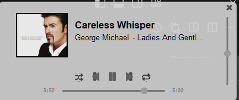

# SpotifyBar 
The app lets you have a tiny spotify bar at the borders of your screen:

# Setup
To setup the app, you need to go to [spotify api dashboard](https://developer.spotify.com/dashboard) and create an app.
When creating the app, the only thing that is important is having the redirect uri be "http://localhost:5000/callback".
After you've created the app, go to the apps' settings, and saved the Client ID and Client secret in a .env file as follows:

    CLIENT_ID:{YOUR_CLIENT_ID}
    CLIENT_SECRET:{YOUR_CLIENT_SECRET}
    REFRESH_TOKEN:{LEAVE_EMPTY}