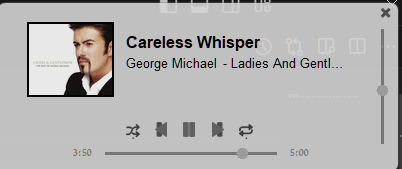

# SpotifyBar 
The app lets you have a tiny spotify bar at the borders of your screen:

# Setup
To setup the app, you need to go to [spotify api dashboard](https://developer.spotify.com/dashboard) and create an app.
When creating the app, the only thing that is important is having the redirect uri be "http://localhost:5000/callback".
After you've created the app, go to the apps' settings and save the Client ID and Client secret in a .env file as follows:

    CLIENT_ID:{YOUR_CLIENT_ID}
    CLIENT_SECRET:{YOUR_CLIENT_SECRET}
    REFRESH_TOKEN:{LEAVE_EMPTY}

Store the .env file inside the base folder of the app.

# Customization
You can customize some aspects of the app inside the config.ini file created in the base folder of the app:

    program_title=
    opacity=
    background_color=
    position=
    padding=

If the file is left empty, the default settings will be set.

Options for the position: `top_start`, `top_end`, `bottom_start`, `bottom_end`.